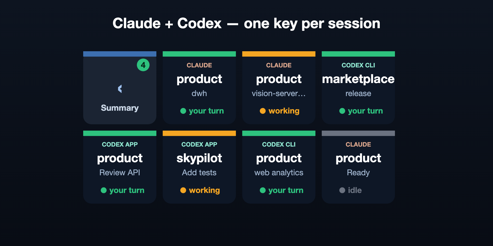

# Claude & Codex Sessions — Stream Deck + plugin

Shows **Claude Code CLI**, **Codex CLI**, and **loaded Codex desktop tasks** on the Stream Deck +. Press a key to open the matching **iTerm2 tab** or **Codex desktop task**.

> **Unofficial / community project.** Not affiliated with, sponsored, or endorsed by Anthropic or OpenAI.
> "Claude" and "Claude Code" are trademarks of Anthropic; Codex is an OpenAI product.
> **Requires macOS + a Stream Deck +. CLI navigation also requires iTerm2.**



[Download](https://github.com/SalikovAlex/streamdeck-claude-sessions/releases/latest) · [Changelog](CHANGELOG.md) · [Contributing](CONTRIBUTING.md)

## Install (users)

1. Download the latest `com.salikov.claude-sessions.streamDeckPlugin` from [Releases](https://github.com/SalikovAlex/streamdeck-claude-sessions/releases) and double-click it to install.
2. When prompted, install the bundled **Claude Sessions** profile to your Stream Deck +.
3. For CLI sessions, grant Automation permission on first use: *System Settings → Privacy & Security → Automation → Elgato Stream Deck → enable iTerm*, then restart the Stream Deck app.

See [PUBLISHING.md](PUBLISHING.md) for release / Marketplace details.

- The bundled 2×4 deck has one Summary control and up to seven session keys. Additional sessions are included in the summary count.
- Each key shows **CLAUDE**, **CODEX CLI**, or **CODEX APP**, the **project** (working-directory basename), and a session label or desktop task title.
- **Claude status** (top color bar + dot + label), inferred from the glyph Claude Code puts in the iTerm2 tab title:
  - 🟡 **working** (amber) — a braille spinner is showing / the session is producing output: Claude is thinking or running a tool.
  - 🟢 **your turn** (green) — the `✳` glyph: Claude finished its turn and wants you (next prompt, a question, or a permission confirm).
  - ⚪ **idle** (grey) — no recognisable Claude state.
  - Note: a permission/question prompt and "finished, ready" both surface as `✳` from outside the process, so both read as **your turn** — they can't be told apart without cooperation from Claude Code itself.
- **Codex status** comes from the latest local turn record when available: **working** for a turn in progress, **your turn** after completion/interruption/failure, and **idle** when no state is available. Older versions fall back to session rollout events; CLI sessions can also fall back to terminal spinner/output activity. Approval and question prompts are not consistently persisted and may remain **working** until the turn ends.
- Empty slots show a dim `empty` placeholder.
- **Two ways to use it (keys self-assign roles by relative position — works in any profile/device):**
  - **The deck** (the bundled *Claude Sessions* profile, or any profile with ≥2 of the keys): shows session keys; the first key is a **`‹ Summary`** control that returns to the previous profile (badged with how many sessions need you). Tap a session to open its iTerm2 tab or Codex task.
  - **A lone key** (drop a single Agent Session action into any other profile, e.g. *Wave Link SD+*): a compact **summary card** — `N sessions` with per-status counts and a `▸ show all` hint. Tap it to open the full deck; tap `‹ Summary` there to come back.
- The keys refresh every 2s while visible; the plugin goes idle otherwise.
- Press a session key → the matching iTerm2 window/tab or Codex desktop task is brought to the front. If a session exits, its old key alerts instead of opening a different session.
- **Property Inspector** (when you select a key in the Stream Deck app) shows an *Info* panel with the plugin version and a live status line and separate counts for Claude, Codex CLI, and Codex app tasks.

## Codex support

Run `codex` in iTerm2, or keep a task loaded in the Codex desktop app. Both appear automatically alongside Claude. No API key, hooks, or Codex configuration changes are needed.

Desktop support tracks local tasks whose session files are held open by a running `Codex.app` or `ChatGPT.app` Codex app server. It excludes archived tasks and subagents. It does not list the full saved history, remote/cloud tasks, or VS Code app-server tasks. Pressing a desktop key opens `codex://threads/<task-id>`.

The reader uses Codex's local SQLite metadata and turn history in read-only mode, with a bounded JSONL rollout fallback for older versions. It discovers the Codex home from open files, including custom `CODEX_HOME` directories. These are internal file formats; future incompatible Codex versions can require a plugin update. No conversation data is sent over the network by the plugin.

If CLI state is unavailable, keep terminal title updates enabled. Current Codex exposes this as [`tui.terminal_title`](https://learn.chatgpt.com/docs/config-file/config-reference), which defaults to spinner and project. Output-based status is approximate.

The plugin UUID, action UUID, and bundled **Claude Sessions** profile name stay the same, so existing keys and profile navigation continue working after an update.

## How it works

1. `ps -axo pid=,ppid=,tty=,args=` detects Claude and Codex CLI processes and the Codex desktop app server. Codex's npm launcher/native child count as one session; service and noninteractive commands are excluded.
2. `lsof -d cwd` resolves CLI working directories. Open Codex rollout/lock files identify loaded task IDs.
3. Local Codex metadata supplies project names, task titles, and turn status. Claude retains its existing iTerm2 title status detection.
4. **TTY resolution:** walk the process ancestry until a TTY belongs to iTerm2, including qterm's extra pty. Desktop navigation uses a task link.
5. Keys render as SVG data URIs, assigned by relative row/column order per device. A pressed key keeps its displayed session identity even if the process list reorders.

## Requirements / gotchas

- **macOS Automation permission.** The Stream Deck app must be allowed to control iTerm2: *System Settings → Privacy & Security → Automation → Elgato Stream Deck → iTerm*. Without it, the iTerm2 tab names and focus-on-press won't work (you'll still see project names). TCC changes require a plugin restart.
- Absolute tool paths are used (`/usr/sbin/lsof` etc.) because the plugin runs with a minimal PATH.
- CLI navigation is iTerm2-specific (uses its AppleScript dictionary). Desktop task navigation does not require iTerm2 or Automation permission.
- Claude processes must be named `claude`. Codex supports native binaries and common npm `node …/codex.js` launchers.

## Build & install

Requires Node.js 20+, npm, macOS 12+, and Stream Deck app 6.9+. CLI navigation requires iTerm2; desktop-only use does not.

Requires Node.js 20+, npm, macOS 12+, iTerm2, and Stream Deck app 6.9+. The app supplies its own Node.js runtime when running the plugin.

```sh
npm ci
npm test                            # detection, status, and local-data regression tests
npm run typecheck
npm run build                       # bundles src → com.salikov.claude-sessions.sdPlugin/bin/plugin.js
node scripts/build-profile.mjs      # regenerates "Claude Sessions.streamDeckProfile" (the importable page)
npx @elgato/cli dev
npx @elgato/cli dev
npx @elgato/cli link com.salikov.claude-sessions.sdPlugin
npx @elgato/cli restart com.salikov.claude-sessions
```

`npm run watch` rebuilds and restarts on change. Logs: `com.salikov.claude-sessions.sdPlugin/logs/`.

### Package for distribution

```sh
npm run build
node scripts/build-profile.mjs
npx @elgato/cli validate com.salikov.claude-sessions.sdPlugin
npx @elgato/cli pack com.salikov.claude-sessions.sdPlugin --force   # -> com.salikov.claude-sessions.streamDeckPlugin
```

Double-click the resulting `.streamDeckPlugin` to install it as a normal (non-dev) plugin on any Mac. Note: it shares the UUID `com.salikov.claude-sessions`, so unlink the dev version first (`npx @elgato/cli unlink com.salikov.claude-sessions`) if installing the package on this same machine.

The 8-key page ships as `Claude Sessions.streamDeckProfile` (referenced from the manifest's `Profiles`). Stream Deck prompts to install it on first plugin install; you can also re-import by opening the file.

## Privacy and support

The plugin reads local process arguments, working directories, iTerm2 tab titles, and metadata and status from loaded Codex tasks to identify sessions. It communicates with Stream Deck over a local WebSocket and has no telemetry or external service calls.

Local diagnostic logs in `com.salikov.claude-sessions.sdPlugin/logs/` contain project names, session labels, tab titles, and status changes. Logs are excluded from Git. Review and redact logs and screenshots before sharing them in an issue.

For bugs, open a [GitHub issue](https://github.com/SalikovAlex/streamdeck-claude-sessions/issues) with the plugin, macOS, Stream Deck, and iTerm2 versions, reproduction steps, and redacted diagnostics. Contributions are welcome; see [AGENTS.md](AGENTS.md) for implementation guidance and verification steps.

## License

[MIT](LICENSE) © Alexander Salikov
